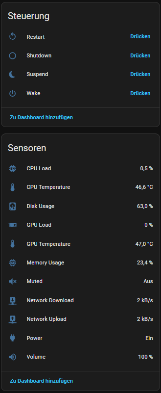

# MQTT Status (Decky Plugin)

A [Decky Loader](https://decky.xyz/) plugin for SteamOS (Steam Deck / Steam Machine / DIY
HTPCs) that connects your device to MQTT and Home Assistant:

- **System stats over MQTT**: CPU load, RAM, disk usage, CPU/GPU temperature, GPU load,
  network up/down rate, IP address, uptime, battery (only on devices that have one) —
  published every few seconds (configurable).
- **Real-time volume**: volume level and mute state are published instantly on every change
  (via `pactl subscribe` + `wpctl`, no polling delay).
- **Relative volume buttons (+/-)**: optionally replaces the Game Mode volume slider with
  the +/- buttons (SteamOS "ExternalVolume" mechanism). Every press — up, down, mute — is
  published as an MQTT event, even at 100% volume or while muted. Perfect for controlling
  an AV receiver or amplifier through Home Assistant.
- **Home Assistant MQTT discovery**: all sensors, a Power (on/off) binary sensor and
  Suspend / Shutdown / Restart / Wake buttons appear automatically on one device.
- **Remote power control**: suspend, shutdown and reboot via MQTT; wake via Wake-on-LAN
  (sent by a small Home Assistant automation, see below).

> Built with the help of AI (Claude Code). Not affiliated with Valve.

## Screenshots


*Connection Settings in the Decky Menu*


*Live Status & MQTT Discovery Toggle*


*Integrated volume control (+/- buttons) in the Quick Access Menu*


*The final device overview in Home Assistant including all sensors, power buttons, and volume events*


## Requirements

- SteamOS 3.x with [Decky Loader](https://decky.xyz/) installed
- An MQTT broker (e.g. the Mosquitto add-on in Home Assistant)
- Optional: Home Assistant with the MQTT integration for auto-discovery

## Installation

1. Download `decky-mqtt-status.zip` (or build it yourself, see below).
2. In Game Mode: Decky → gear icon → enable **Developer mode** → **Developer** tab →
   **Install Plugin from ZIP** → select the zip.
3. Open the plugin in the Quick Access menu, enter your broker host/port/credentials and
   press **Save & Connect**.

## Building from source

Frontend (any OS with Node.js + pnpm):

```bash
pnpm install
pnpm run build        # produces dist/index.js
```

Python dependencies must be vendored into `py_modules/` **as Linux packages**:

```bash
pip install --target=py_modules --platform manylinux2014_x86_64 --python-version 311 \
    --implementation cp --abi abi3 --only-binary=:all: --no-deps psutil==5.9.8
pip install --target=py_modules --no-deps paho-mqtt==1.6.1
```

Then zip the folder (`plugin.json`, `package.json`, `main.py`, `dist/`, `py_modules/`)
**with forward-slash paths** — on Windows use Python's `zipfile`, not `Compress-Archive`.

## MQTT topics

With the default base topic `decky/steamdeck` (configurable):

| Topic                            | Payload                          | Notes                                   |
|----------------------------------|----------------------------------|-----------------------------------------|
| `<base>/availability`            | `online` / `offline`             | Retained; last-will marks offline       |
| `<base>/stats`                   | JSON                             | All system stats, retained              |
| `<base>/volume/level`            | `0`–`100`                        | Retained, instant on change             |
| `<base>/volume/muted`            | `ON` / `OFF`                     | Retained                                |
| `<base>/volume/button`           | `{"event_type": "volume_up"}`    | Event per +/- press (also `volume_down`, `mute_toggle`) |
| `<base>/power/set` (subscribe)   | `suspend` / `shutdown` / `reboot`| Executes the action; `wake` is ignored by the plugin (handled by HA, see below) |

## Power buttons & Wake-on-LAN

**Suspend/shutdown/reboot** need a one-time polkit rule, because the plugin backend runs
outside a user session. Create `/etc/polkit-1/rules.d/49-decky-mqtt-power.rules` (as root):

```js
polkit.addRule(function(action, subject) {
    if (subject.user == "deck" &&
        (action.id == "org.freedesktop.login1.suspend" ||
         action.id == "org.freedesktop.login1.suspend-multiple-sessions" ||
         action.id == "org.freedesktop.login1.power-off" ||
         action.id == "org.freedesktop.login1.power-off-multiple-sessions" ||
         action.id == "org.freedesktop.login1.reboot" ||
         action.id == "org.freedesktop.login1.reboot-multiple-sessions")) {
        return polkit.Result.YES;
    }
});
```

Then `sudo systemctl restart polkit`.

**Wake** cannot be done by a sleeping machine, so the Wake button publishes `wake` to
`<base>/power/set` and a Home Assistant automation sends the magic packet:

```yaml
# configuration.yaml
wake_on_lan:
```

```yaml
# automation (adjust base topic and MAC address!)
alias: SteamOS Wake Button
triggers:
  - trigger: mqtt
    topic: decky/steamdeck/power/set
    payload: wake
actions:
  - action: wake_on_lan.send_magic_packet
    data:
      mac: "AA:BB:CC:DD:EE:FF"
mode: single
```

Enable WoL on the device (persists via NetworkManager):

```bash
nmcli connection modify "Wired connection 1" 802-3-ethernet.wake-on-lan magic
```

## Troubleshooting

- **Plugin doesn't appear after manual install** — check
  `journalctl -u plugin_loader`. `ModuleNotFoundError`: helper modules must live inside
  `py_modules/`. `SyntaxError: Unexpected token 'export'`: `package.json` with
  `"type": "module"` must be included next to `plugin.json`.
- **Volume/Muted sensors stay unknown** — the Decky sandbox strips `XDG_RUNTIME_DIR`;
  this plugin restores it before calling `wpctl`/`pactl`. If you fork this, keep
  `proc_env.py`.
- **`systemctl` calls fail with `OPENSSL_x.y.z not found`** — Decky (a PyInstaller
  binary) exports `LD_LIBRARY_PATH` to its bundled libs; strip it for subprocesses
  (also handled in `proc_env.py`).
- **Suspend/shutdown buttons do nothing, log says "Interactive authentication
  required"** — install the polkit rule above.
- **+/- buttons don't show up after enabling** — Steam only reads the external-volume
  capability at session start: restart Steam or reboot once. Also check the plugin's
  status line — it should say `Config written (card: alsa_card.pci-...)`. "No HDMI audio
  output found" means the HDMI/DP audio card wasn't detected; make sure audio is
  currently routed through HDMI/DisplayPort.
- **"Volume Buttons" event entity shows "unknown" in HA** — normal until the first
  button press arrives.
- **Wake button does nothing** — the HA automation's MQTT topic must match your
  configured base topic exactly (check the automation trace in HA).
- **Power sensor slow to turn off on suspend** — the broker flags the device offline
  after the MQTT keepalive (~15 s). Suspending via the HA button is instant, because the
  plugin unpublishes availability first.

## License

BSD-3-Clause. Do whatever you like with it — if you want to maintain this properly on
GitHub, go for it.
